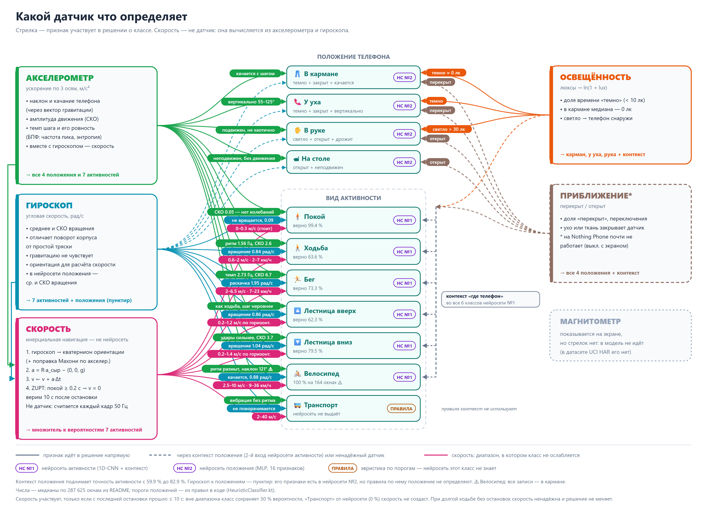

# Распознавание активности пользователя по данным датчиков

Android-приложение непрерывно определяет тип физической активности пользователя
по данным пяти датчиков телефона, показывает решение на экране и ведёт журнал.

**Классы активности:** покой, ходьба, бег, подъём по лестнице, спуск по
лестнице, поездка в транспорте, велосипед.
**Положение телефона:** в кармане, в руке, у уха, на столе.

Решение принимают две модели TensorFlow Lite, лежащие в `app/src/main/assets/`.
Если их там нет, приложение работает на эвристическом классификаторе по явным
правилам и честно сообщает об этом в интерфейсе.

---

## Что в репозитории

```
app/src/main/java/com/example/har/
├── sensors/
│   ├── SensorSample.kt      кадр показаний + доступность датчиков
│   ├── SensorHub.kt         подписка на 5 датчиков, сетка 50 Гц, выделение гравитации
│   └── SlidingWindow.kt     кольцевой буфер, нарезка на перекрывающиеся окна
├── motion/
│   └── InertialSpeedEstimator.kt  скорость: кватернион, вычитание g, интегрирование, ZUPT
├── features/
│   ├── Fft.kt               БПФ Кули — Тьюки с окном Ханна
│   └── FeatureExtractor.kt  вход моделей + интерпретируемая сводка окна
├── ml/
│   ├── Labels.kt            классы активности и положения
│   ├── ModelMeta.kt         чтение и валидация model_meta.json
│   ├── TfLiteModel.kt       обёртка над интерпретатором TFLite
│   ├── HeuristicClassifier.kt  резервный классификатор на правилах
│   ├── SpeedFusion.kt       уточнение вероятностей активности по скорости
│   ├── ProbabilitySmoother.kt  сглаживание + гистерезис
│   └── ActivityRecognizer.kt   конвейер: окно → признаки → модель → класс
├── data/
│   ├── db/                  Room: окна, интервалы, DAO
│   ├── LogRepository.kt     ведение журнала, слияние окон в интервалы
│   └── CsvExporter.kt       выгрузка через FileProvider
├── collect/DatasetRecorder.kt   запись размеченного датасета
├── service/
│   ├── RecognitionEngine.kt     конвейер и его состояние (живёт в Application)
│   └── RecognitionService.kt    передний сервис: работа при погашенном экране
└── ui/                      Compose: «Сейчас», «Скорость», «Журнал», «Сбор данных», «О модели»

ml/
├── features.py      зеркало FeatureExtractor.kt (признаки положения)
├── datasets.py      загрузка UCI HAR, RealWorld HAR и собственных CSV
├── train.py         обучение обеих моделей и экспорт в assets
├── evaluate.py      проверка экспортированных .tflite
└── report.py        генерация раздела с числами в конце этого файла
```

Данные обучения (`ml/data/`) в репозиторий не входят: это 3.5 ГБ публичных
датасетов, которые `datasets.py` скачивает и кэширует сам.

## Сборка

Нужны **JDK 21** (Gradle 8.9 не работает на JDK 25, встроенном в Android
Studio 2026.1 — переключите *Settings → Build, Execution, Deployment → Build
Tools → Gradle → Gradle JDK*) и **Android SDK** Platform 35,
Build-Tools 35.0.0. minSdk 26.

```bash
./gradlew testDebugUnitTest    # модульные тесты обработки сигнала
./gradlew assembleDebug        # APK в app/build/outputs/apk/debug/
./gradlew installDebug         # установка на подключённый телефон
```

Нужны переменные окружения `JAVA_HOME` и `ANDROID_HOME`, либо файл
`local.properties` со строкой `sdk.dir=C:/Users/<имя>/AppData/Local/Android/Sdk`.
Слэши прямые: в формате `.properties` обратный слэш экранирует, и путь
с `\` разберётся неверно.

Эмулятор не подойдёт — у него нет настоящих датчиков движения. Пакет
`com.example.har` — заглушка; для публикации переименуйте его и поправьте
`applicationId` и `namespace` в `app/build.gradle.kts`.

Пересчитать раздел с числами в конце файла:

```bash
python ml/report.py --write-readme       # все источники, несколько минут
python ml/report.py --source own+uci     # быстро, без RealWorld
```

---

## Что показывает экран во время записи

Экран «Сейчас» обновляется непрерывно и содержит три блока: сырые показания
датчиков, признаки последнего окна и статистику сессии. Ниже разобрано, что
означает каждое значение и откуда оно берётся.

### Блок «Показания датчиков» — то, что отдаёт железо

Это мгновенный кадр без усреднения, он меняется десятки раз в секунду. Общее
назначение каждого датчика:

| Датчик | Измеряемая величина | Единица | Роль в распознавании |
|---|---|---|---|
| Акселерометр | собственное ускорение, три оси | м/с² | основной сигнал: амплитуда и ритм движения |
| Гироскоп | угловая скорость, три оси | рад/с | вращение корпуса: повороты, раскачка |
| Магнитометр | магнитная индукция, три оси | мкТл | изменение курса и близость металла |
| Приближение | расстояние до препятствия | см, фактически бинарно | телефон в кармане, в сумке или у уха |
| Освещённость | освещённость | лк | темно (карман) или светло (в руке) |

Опрашиваются с разной частотой: акселерометр и гироскоп на 100 Гц, магнитометр
на 50 Гц, приближение и освещённость событийно (`SENSOR_DELAY_NORMAL`, единицы
герц). Дальше всё сводится к единой сетке 50 Гц. Ниже — что именно каждая
из этих величин означает физически.

#### Акселерометр: собственное ускорение и ускорение свободного падения

Внутри — MEMS-структура: подвижная масса на упругих подвесах, её смещение
относительно корпуса меняет ёмкость между гребёнками электродов, и эта ёмкость
преобразуется в число. Но масса смещается не от «ускорения телефона», а от силы,
которая действует на неё со стороны подвеса. Поэтому датчик измеряет
**собственное (кажущееся) ускорение** — сумму ускорения корпуса и реакции опоры,
компенсирующей вес. В Android это `TYPE_ACCELEROMETER`, единица — м/с².

Отсюда три следствия, без которых числа на экране читаются неверно.

**Лежащий телефон показывает не ноль, а 9.81.** Стол давит на телефон снизу
с силой, равной весу, и датчик регистрирует именно её. Модуль вектора равен
ускорению свободного падения g = 9.80665 м/с² — эта константа зашита
в `FeatureExtractor.G` и используется для нормировки. Ноль акселерометр покажет
в противоположной ситуации: в свободном падении опоры нет, и брошенный телефон
покажет ноль, а лежащий — g.

**Распределение g по осям зависит от поворота, а не от движения.** Телефон
экраном вверх на столе: `az ≈ +9.81`, `ax ≈ ay ≈ 0`. Поставленный вертикально:
`ay ≈ 9.81`. В кармане под произвольным углом — произвольная тройка чисел, сумма
квадратов которых по-прежнему даёт g². Поэтому судить о движении по отдельным
осям нельзя: они меняются, когда человек всего лишь повернулся.

**Гравитацию убирают дважды, двумя разными способами.**

1. *Векторно* — чтобы получить и ориентацию, и линейное ускорение. `SensorHub`
   пропускает каждую ось через фильтр нижних частот:
   `grav ← α·grav + (1 − α)·acc` при α = 0.9. На частоте 50 Гц это постоянная
   времени около 0.2 с: вектор успевает следить за поворотом телефона, но
   не реагирует на шаги, потому что шаг — это 1.5–2 Гц, то есть быстрее.
   Остаток `acc − grav` и есть ускорение движения, а из самого вектора `grav`
   получаются наклон телефона и стабильность ориентации.

2. *Скалярно* — перед спектром. Признаки считаются по модулю
   `|acc| = √(ax² + ay² + az²)`, потому что модуль не зависит от поворота.
   Но у модуля есть постоянная составляющая около g, и если подать его в БПФ
   как есть, почти вся энергия уйдёт в нулевой бин, а полезные 1–5 Гц потонут
   на его фоне. Поэтому перед спектром вычитается среднее по окну.

Насколько g доминирует, видно по данным. Средний модуль ускорения меняется
от 9.77 м/с² у покоя до 11.35 у бега — то есть на 16 %. СКО того же модуля
за то же время меняется от 0.05 до 6.66, то есть в 130 раз. Вся информация
о классе лежит в отклонениях от g, а не в самой величине; поэтому средний
модуль ни для одного класса не оказался различающим признаком.

#### Гироскоп: угловая скорость

Измеряется **угловая скорость**, а не угол: насколько быстро телефон
поворачивается вокруг каждой из трёх своих осей. Единица — радиан в секунду,
1 рад/с ≈ 57.3 °/с. Принцип тот же MEMS, но работает сила Кориолиса: внутри
вибрирует масса, при повороте корпуса на неё действует сила, перпендикулярная
и колебанию, и оси вращения, и это отклонение измеряется.

Главное отличие от акселерометра — гироскоп **не чувствует гравитацию**.
Неподвижный телефон, как бы он ни был повёрнут, показывает ноль по всем осям.
Поэтому гироскоп различает случаи, в которых акселерометр бессилен: телефон
может трястись, не поворачиваясь (транспорт на неровной дороге), и
поворачиваться, почти не трясясь (велосипед).

Угол можно получить интегрированием угловой скорости, но ошибка при этом
накапливается и уходит в дрейф, поэтому приложение не интегрирует, а пользуется
скоростью напрямую. Ориентацию оно берёт из вектора гравитации, а не из
гироскопа.

#### Магнитометр: магнитная индукция

Измеряется **магнитная индукция** (плотность магнитного потока) по трём осям,
единица — микротесла. Поле Земли даёт 25–65 мкТл в зависимости от широты.
Принцип — эффект Холла либо магниторезистивный элемент.

Датчик показывает сумму поля Земли и локальных искажений от всего железного
рядом. Отсюда двойная польза: по направлению поля определяется курс, а по резким
искажениям — близость крупных металлических масс, то есть косвенно транспорт.

В нейросеть магнитометр не попадает, и это осознанный компромисс, а не
упущение. Модель обучается на пересечении каналов трёх источников, а в UCI HAR
магнитометра нет, поэтому в сеть идут 6 каналов — три оси акселерометра и три
гироскопа. Подмешивать нулевой магнитометр там, где его не измеряли, значило бы
учить сеть на артефакте, которого на устройстве не бывает.

#### Датчик приближения: расстояние до препятствия

Формально измеряется **расстояние** до ближайшего препятствия перед экраном,
единица — сантиметры. Физически: инфракрасный светодиод подсвечивает, фотодиод
рядом измеряет отражённый свет, и по его интенсивности оценивается расстояние.
У большинства телефонов датчик фактически бинарный — отдаёт либо 0, либо своё
`maximumRange`. Поэтому приложение не сравнивает с нулём, а берёт порог
в половину `maximumRange` (по умолчанию 5 см) и превращает показание
в «перекрыт / открыт».

На Nothing Phone (A059) этот датчик оказался бесполезен: он расположен под
экраном и отключается вместе с ним, поэтому даже в записях «в кармане»
показывает «перекрыт» лишь 0–0.4 % времени вместо ожидаемых ста процентов.
Признак `prox_near_ratio` в модель подаётся, но информации не несёт.

#### Датчик освещённости: освещённость

Измеряется **освещённость** — световой поток на единицу площади, единица люкс
(1 лк = 1 лм/м²). Это фотометрическая, а не энергетическая величина: фотодиод
снабжён фильтром, приводящим его спектральную чувствительность к чувствительности
человеческого глаза, поэтому люксы описывают «сколько света для человека»,
а не полную мощность излучения.

Порядки величин: карман или закрытая сумка — 0 лк, освещённое помещение —
100–500, пасмурная улица — несколько тысяч, прямое солнце — до 100 000.
Динамический диапазон огромный, поэтому в признак подаётся не само значение,
а логарифм: `ln(1 + lux) / ln(1 + 40000)`. Порог темноты — 10 лк
(`DARK_LUX_THRESHOLD`).

Этот датчик работает: медиана в кармане — 0 лк. Он основной для различения
кармана и руки и влияет также на распознавание активности, потому что один и тот
же рисунок ускорения означает разное, когда телефон в кармане и когда лежит
на столе.

Если датчика в телефоне нет, строка показывает «нет датчика», а соответствующие
признаки подаются в модель нулями.

### Как из показаний получаются признаки

```
5 датчиков ──► SensorHub ──► SlidingWindow ──► FeatureExtractor ──► модели ──► SpeedFusion
  разные       единая сетка   окна 128 отсчётов    7 величин на экран            ▲
  частоты         50 Гц       (2.56 с, сдвиг 64)   + 16 для моделей               │
                    │                                                             │
                    └──► InertialSpeedEstimator (каждый кадр) ── скорость ────────┘
```



Датчики Android отдают события с разной и плавающей частотой. `SensorHub`
приводит их к единой сетке 50 Гц: акселерометр задаёт такт, остальные каналы
подставляются последним известным значением. Кольцевой буфер выдаёт окна по
128 отсчётов со сдвигом 64, то есть с перекрытием 50 %, — решение принимается
каждые 1.28 с.

### Блок «Признаки окна (2.56 с)» — то, на что смотрит модель

Эти числа не измеряются датчиками напрямую — это производные величины,
посчитанные по окну из 128 отсчётов. Именно они объясняют, почему выбран тот
или иной класс. Первые пять описывают движение и не зависят от того, как
повёрнут телефон, следующие две — наоборот, описывают только положение,
последняя — скорость по инерциальной навигации.

**СКО ускорения**, м/с² — насколько сильно модуль ускорения отклоняется от
своего среднего за окно, то есть амплитуда движения. У лежащего телефона это
сотые доли, у ходьбы около 2.6, у бега 6.7.

**Частота главного пика**, Гц — самая сильная частота в полосе 0.5–5 Гц,
в которой лежит человеческая локомоция. Для ходьбы и бега это буквально темп
шага: 1.56 Гц — примерно 94 шага в минуту. Считается через БПФ с окном Ханна,
подавляющим растекание спектра на краях окна. У покоя это число
бессмысленно — периодики нет, и максимум приходится на шум.

**Мощность главного пика**, м/с² — амплитуда этой самой сильной частоты.
Показывает, насколько ритм выражен: у ходьбы около 1.3, у велосипеда 0.5,
у покоя 0.01. Вместе с частотой отвечает на вопрос «есть ли вообще ритм
и какой он».

Раньше на этом месте экрана стояла строка «СКЗ линейного ускорения», но она
всегда показывала то же число, что и СКО ускорения: в `FeatureExtractor.stats`
линейное ускорение получается вычитанием среднего модуля, а среднеквадратичное
значение такой величины — это по определению её СКО, разница ровно ноль.
Строка заменена на мощность пика, которая уже считалась и использовалась
эвристикой, но на экран не выводилась. В таблицах ниже СКЗ приводится
в честном виде — после вычитания вектора гравитации.

**Спектральная энтропия**, нат — информационная мера того, насколько энергия
размазана по частотам. Считается как энтропия Шеннона от спектра мощности,
нормированного до распределения; «нат» — натуральные единицы, потому что
логарифм берётся натуральный, а не двоичный.
Низкая означает, что почти всё сосредоточено в одном пике, то есть движение
периодично. Это главное различие между шагом и тряской: у ходьбы около 1.57,
у покоя и велосипеда около 2.0.

**Среднее вращение**, рад/с — средний модуль угловой скорости за окно.
Отличает движения, при которых корпус телефона поворачивается, от тех, при
которых он только трясётся.

**Наклон телефона**, ° — угол между усреднённым вектором гравитации и осью Z.
0° — экран смотрит вверх, 90° — телефон стоит вертикально. Признак не про
активность, а про положение: у уха телефон почти вертикален.

**Стабильность ориентации**, безразмерная — среднее СКО трёх компонент
единичного вектора гравитации за окно. Ноль означает, что телефон не
поворачивался вовсе. Растёт вместе с раскачкой корпуса: у покоя 0.00,
у ходьбы 0.05, у бега 0.14.

**Скорость (инерц. навигация)**, км/ч — горизонтальная скорость, посчитанная
по акселерометру и гироскопу (см. раздел «Скорость по инерциальной навигации»).
В отличие от остальных строк, она считается не по окну, а накапливается кадр
за кадром. Пока с последней остановки прошло не больше 10 с, число участвует
в решении. Позже рядом пишется «ненадёжно» и сколько секунд прошло без остановки.

### Блок «Статистика сессии»

Состояние сервиса, число обработанных кадров и классифицированных окон, время
работы и то, кто принимает решение — нейросеть или эвристика. Последняя строка
нужна, чтобы отличать «модель отдала класс» от «модель не загрузилась».

### Что происходит после модели

Сначала вероятности активности уточняются по скорости, если ей сейчас можно
верить (подробно — в следующем разделе). Затем идёт сглаживание. Решения принимаются каждые 1.28 с, и без сглаживания класс дребезжал бы на
переходах. Применяется экспоненциальное сглаживание вектора вероятностей плюс
гистерезис: смена класса требует уверенного перевеса, одно окно её не вызывает.
Поэтому подпись на экране меняется заметно медленнее, чем сами признаки.

### Скорость по инерциальной навигации

`motion/InertialSpeedEstimator.kt` считает горизонтальную скорость на каждом
кадре 50 Гц:

1. угловая скорость гироскопа интегрируется в кватернион ориентации, а дрейф
   наклона гасится комплементарной поправкой по акселерометру (фильтр Махони);
2. ускорение поворачивается в земные координаты, и из вертикали вычитается g;
3. линейное ускорение интегрируется в скорость;
4. ZUPT: если телефон неподвижен дольше 0.2 с, скорость обнуляется, а опорное g
   уточняется под конкретный датчик.

Между остановками ошибка растёт без предела: 1° ошибки наклона даёт 1.7 м/с
через 10 с. Поэтому скорости верят только 10 с после последнего ZUPT. В это
время `ml/SpeedFusion.kt` умножает вероятности активности на правдоподобие
скорости для каждого класса (ходьба 0.6–2 м/с, бег 2–6.5, велосипед 2.5–10 и т. д.)
и нормирует их заново. Скорость может ослабить класс не больше чем до 30 % его
вероятности, но не запретить его. Вне этого окна решение модели не меняется.
У телефона в кармане при ходьбе моментов покоя нет, так что на длинной прогулке
скорость помечается как ненадёжная и в решении не участвует.

Порядок в конвейере: модель (или эвристика) → `SpeedFusion` → сглаживание.
Магнитометр для курса не используется: для скорости достаточно модуля
горизонтальной составляющей, а направление движения не нужно.

Текущая скорость крупным числом показывается на отдельной вкладке «Скорость».
Она обновляется 5 раз в секунду по последнему кадру, а не по окну. Когда
скорости верить нельзя, число становится бледным, а под ним появляется,
сколько секунд прошло без остановки. Кроме того, скорость показывается в
признаках окна на экране «Сейчас» и пишется в журнал окон
(`speed_ms`, `speed_reliable`; база данных версии 2).

В журнал пишутся два уровня: покадровый (каждое окно со всеми признаками) и
агрегированный, где соседние окна одного класса слиты в интервал — «Ходьба,
10:31–10:47, 16 мин». Оба выгружаются в CSV.

---

<!-- STATS:BEGIN -->
## Почему такие показания означают именно этот класс

_Раздел сгенерирован `ml/report.py` 2026-09-27. Пересчитать: `python ml/report.py --write-readme`._

### На чём считается статистика

Окон всего: **287 625**, каналов: **6** (acc_x, acc_y, acc_z, gyro_x, gyro_y, gyro_z), испытуемых: **60**, источники: own, rw, uci

| Класс | Метка | Окон |
|---|---|---|
| Покой | `STILL` | 131 195 |
| Ходьба | `WALKING` | 41 242 |
| Бег | `RUNNING` | 50 093 |
| Лестница вверх | `STAIRS_UP` | 35 585 |
| Лестница вниз | `STAIRS_DOWN` | 28 923 |
| Велосипед | `CYCLING` | 587 |

### Какие показания выдают каждый класс

По каждому классу — диапазоны всех величин, которые приложение показывает в блоке «Признаки окна», и класс, с которым его легче всего спутать. Медиана с межквартильным размахом, а не среднее: распределения несимметричны, и одно окно с артефактом сдвигает среднее.

#### Покой — 131 195 окон

Узнаётся по отсутствию сигнала: СКО ускорения — сотые доли м/с², мощность пика почти ноль, ориентация постоянна. Частота главного пика при этом показывает случайные 3 Гц, и смотреть на неё не надо: периодического движения нет, максимум спектра приходится на шум датчика. Спутать этот класс не с чем.

Ближе всего к этому классу «Бег»: лучше всех их разделяет «СКО ускорения», с AUC 0.034 — и даже от него класс отделяется уверенно.

| Показание | Медиана [25–75 %] | Ед. |
|---|---|---|
| Средний модуль ускорения | 9.77 [9.67–9.94] | м/с² |
| СКО ускорения | 0.05 [0.03–0.12] | м/с² |
| СКЗ ускорения без гравитации | 0.11 [0.05–0.24] | м/с² |
| Частота главного пика | 3.12 [1.95–4.30] | Гц |
| Мощность главного пика | 0.01 [0.01–0.03] | м/с² |
| Спектральная энтропия | 2.04 [1.91–2.14] | нат |
| Среднее вращение | 0.09 [0.04–0.18] | рад/с |
| СКО вращения | 0.02 [0.01–0.07] | рад/с |
| Наклон телефона | 80.67 [54.77–90.13] | ° |
| Стабильность ориентации | 0.00 [0.00–0.01] | — |
| Частота смены знака | 0.29 [0.23–0.35] | 1/отсчёт |

#### Ходьба — 41 242 окна

Ровный периодический шаг: один отчётливый пик спектра, умеренная амплитуда и низкая энтропия — энергия собрана в этом пике. От бега отличается втрое меньшей амплитудой, от велосипеда — вдвое большей мощностью пика и заметно меньшей энтропией. От лестницы — почти ничем.

Ближе всего к этому классу «Лестница вверх»: лучше всех их разделяет «Частота главного пика», и то лишь с AUC 0.655 — распределения перекрываются почти целиком.

| Показание | Медиана [25–75 %] | Ед. |
|---|---|---|
| Средний модуль ускорения | 10.25 [9.94–10.51] | м/с² |
| СКО ускорения | 2.60 [2.17–3.49] | м/с² |
| СКЗ ускорения без гравитации | 2.98 [2.45–3.96] | м/с² |
| Частота главного пика | 1.56 [1.56–1.95] | Гц |
| Мощность главного пика | 1.28 [1.04–1.66] | м/с² |
| Спектральная энтропия | 1.57 [1.33–1.82] | нат |
| Среднее вращение | 0.84 [0.52–1.62] | рад/с |
| СКО вращения | 0.43 [0.24–0.76] | рад/с |
| Наклон телефона | 86.71 [81.62–92.65] | ° |
| Стабильность ориентации | 0.05 [0.04–0.07] | — |
| Частота смены знака | 0.12 [0.09–0.15] | 1/отсчёт |

#### Бег — 50 093 окна

Тот же шаговый рисунок, что у ходьбы, но темп почти вдвое выше, а амплитуда больше в два с половиной раза: удар пятки при беге не гасится. Самый узнаваемый из движущихся классов — его выдаёт и частота, и амплитуда сразу.

Ближе всего к этому классу «Лестница вниз»: лучше всех их разделяет «Частота главного пика», с AUC 0.867 — и даже от него класс отделяется уверенно.

| Показание | Медиана [25–75 %] | Ед. |
|---|---|---|
| Средний модуль ускорения | 11.35 [10.11–13.08] | м/с² |
| СКО ускорения | 6.66 [5.58–7.43] | м/с² |
| СКЗ ускорения без гравитации | 9.09 [7.13–10.80] | м/с² |
| Частота главного пика | 2.73 [2.73–2.73] | Гц |
| Мощность главного пика | 3.43 [2.40–4.08] | м/с² |
| Спектральная энтропия | 1.32 [1.09–1.82] | нат |
| Среднее вращение | 1.95 [0.95–3.26] | рад/с |
| СКО вращения | 0.92 [0.50–1.56] | рад/с |
| Наклон телефона | 91.34 [83.22–102.04] | ° |
| Стабильность ориентации | 0.14 [0.07–0.22] | — |
| Частота смены знака | 0.13 [0.11–0.19] | 1/отсчёт |

#### Лестница вверх — 35 585 окон

Практически копия ходьбы: тот же темп шага, амплитуда ниже всего на несколько процентов. Отличается чуть более высокой энтропией — шаг по ступеням менее ровный. Самый трудный класс: по движению телефона ступень от ровного пола почти не отличается.

Ближе всего к этому классу «Ходьба»: лучше всех их разделяет «Частота главного пика», и то лишь с AUC 0.345 — распределения перекрываются почти целиком.

| Показание | Медиана [25–75 %] | Ед. |
|---|---|---|
| Средний модуль ускорения | 10.08 [9.84–10.33] | м/с² |
| СКО ускорения | 2.52 [2.03–3.04] | м/с² |
| СКЗ ускорения без гравитации | 2.82 [2.33–3.45] | м/с² |
| Частота главного пика | 1.56 [1.56–1.56] | Гц |
| Мощность главного пика | 1.23 [0.88–1.57] | м/с² |
| Спектральная энтропия | 1.73 [1.50–1.96] | нат |
| Среднее вращение | 0.86 [0.60–1.46] | рад/с |
| СКО вращения | 0.42 [0.27–0.75] | рад/с |
| Наклон телефона | 88.88 [82.04–96.58] | ° |
| Стабильность ориентации | 0.06 [0.05–0.09] | — |
| Частота смены знака | 0.10 [0.08–0.13] | 1/отсчёт |

#### Лестница вниз — 28 923 окна

Спуск ударнее и ходьбы, и подъёма: амплитуда выше примерно на треть, темп чуть быстрее. Приземление на ступень гасится скелетом, а не мышцами, поэтому пики ускорения выходят больше. Именно за счёт амплитуды спуск распознаётся лучше подъёма.

Ближе всего к этому классу «Ходьба»: лучше всех их разделяет «СКО ускорения», с AUC 0.705: разделение есть, но неуверенное.

| Показание | Медиана [25–75 %] | Ед. |
|---|---|---|
| Средний модуль ускорения | 10.18 [9.89–10.51] | м/с² |
| СКО ускорения | 3.66 [2.94–4.38] | м/с² |
| СКЗ ускорения без гравитации | 3.93 [3.17–4.82] | м/с² |
| Частота главного пика | 1.95 [1.56–1.95] | Гц |
| Мощность главного пика | 1.76 [1.28–2.19] | м/с² |
| Спектральная энтропия | 1.68 [1.46–1.89] | нат |
| Среднее вращение | 1.04 [0.68–1.73] | рад/с |
| СКО вращения | 0.55 [0.34–0.93] | рад/с |
| Наклон телефона | 86.70 [81.00–93.49] | ° |
| Стабильность ориентации | 0.06 [0.05–0.08] | — |
| Частота смены знака | 0.11 [0.09–0.14] | 1/отсчёт |

#### Велосипед — 587 окон

Педали крутятся медленнее шага, и удара пятки нет — амплитуда самая низкая среди движущихся классов, а мощность главного пика втрое ниже, чем у ходьбы. При этом энтропия почти как у покоя: вращение педалей даёт не чёткий пик, а размазанный спектр — движение есть, но оно не такое периодичное, как шаг.

Ближе всего к этому классу «Бег»: лучше всех их разделяет «Наклон телефона», с AUC 0.929 — и даже от него класс отделяется уверенно.

**Осторожно с этим классом.** 587 окон против 131 195 у самого многочисленного класса, 6 отрезков записи, 1 положение телефона на теле — `own:POCKET`. Разнообразия мало, и найденная «подпись» может описывать условия записи, а не активность: наклон телефона держится около 121° потому, что во всех записях телефон лежал одинаково, а не потому, что так устроена эта активность. Модель рискует выучить именно угол, и высокая точность по такому классу этого не опровергает.

| Показание | Медиана [25–75 %] | Ед. |
|---|---|---|
| Средний модуль ускорения | 9.88 [9.80–10.00] | м/с² |
| СКО ускорения | 1.65 [1.37–1.91] | м/с² |
| СКЗ ускорения без гравитации | 2.15 [1.81–2.43] | м/с² |
| Частота главного пика | 1.17 [0.78–3.52] | Гц |
| Мощность главного пика | 0.49 [0.36–0.62] | м/с² |
| Спектральная энтропия | 1.92 [1.77–2.04] | нат |
| Среднее вращение | 0.88 [0.71–0.96] | рад/с |
| СКО вращения | 0.39 [0.33–0.44] | рад/с |
| Наклон телефона | 120.86 [117.75–127.28] | ° |
| Стабильность ориентации | 0.09 [0.08–0.10] | — |
| Частота смены знака | 0.26 [0.23–0.30] | 1/отсчёт |


### Все показания по всем классам

Медиана и межквартильный размах [25–75 %] по каждому классу. Медиана, а не среднее: распределения признаков несимметричны, и одно окно с артефактом сдвигает среднее, но не медиану.

| Признак | Ед. | Покой | Ходьба | Бег | Лестница вверх | Лестница вниз | Велосипед |
|---|---|---|---|---|---|---|---|
| Средний модуль ускорения | м/с² | 9.77 [9.67–9.94] | 10.25 [9.94–10.51] | 11.35 [10.11–13.08] | 10.08 [9.84–10.33] | 10.18 [9.89–10.51] | 9.88 [9.80–10.00] |
| СКО ускорения | м/с² | 0.05 [0.03–0.12] | 2.60 [2.17–3.49] | 6.66 [5.58–7.43] | 2.52 [2.03–3.04] | 3.66 [2.94–4.38] | 1.65 [1.37–1.91] |
| СКЗ ускорения без гравитации | м/с² | 0.11 [0.05–0.24] | 2.98 [2.45–3.96] | 9.09 [7.13–10.80] | 2.82 [2.33–3.45] | 3.93 [3.17–4.82] | 2.15 [1.81–2.43] |
| Частота главного пика | Гц | 3.12 [1.95–4.30] | 1.56 [1.56–1.95] | 2.73 [2.73–2.73] | 1.56 [1.56–1.56] | 1.95 [1.56–1.95] | 1.17 [0.78–3.52] |
| Мощность главного пика | м/с² | 0.01 [0.01–0.03] | 1.28 [1.04–1.66] | 3.43 [2.40–4.08] | 1.23 [0.88–1.57] | 1.76 [1.28–2.19] | 0.49 [0.36–0.62] |
| Спектральная энтропия | нат | 2.04 [1.91–2.14] | 1.57 [1.33–1.82] | 1.32 [1.09–1.82] | 1.73 [1.50–1.96] | 1.68 [1.46–1.89] | 1.92 [1.77–2.04] |
| Среднее вращение | рад/с | 0.09 [0.04–0.18] | 0.84 [0.52–1.62] | 1.95 [0.95–3.26] | 0.86 [0.60–1.46] | 1.04 [0.68–1.73] | 0.88 [0.71–0.96] |
| СКО вращения | рад/с | 0.02 [0.01–0.07] | 0.43 [0.24–0.76] | 0.92 [0.50–1.56] | 0.42 [0.27–0.75] | 0.55 [0.34–0.93] | 0.39 [0.33–0.44] |
| Наклон телефона | ° | 80.67 [54.77–90.13] | 86.71 [81.62–92.65] | 91.34 [83.22–102.04] | 88.88 [82.04–96.58] | 86.70 [81.00–93.49] | 120.86 [117.75–127.28] |
| Стабильность ориентации | — | 0.00 [0.00–0.01] | 0.05 [0.04–0.07] | 0.14 [0.07–0.22] | 0.06 [0.05–0.09] | 0.06 [0.05–0.08] | 0.09 [0.08–0.10] |
| Частота смены знака | 1/отсчёт | 0.29 [0.23–0.35] | 0.12 [0.09–0.15] | 0.13 [0.11–0.19] | 0.10 [0.08–0.13] | 0.11 [0.09–0.14] | 0.26 [0.23–0.30] |

На экране телефона показаны не все эти величины: «Средний модуль ускорения», «СКЗ ускорения без гравитации», «СКО вращения» и «Частота смены знака» добавлены в отчёт, потому что помогают объяснить остальные. Средний модуль, например, нужен именно чтобы показать, что он почти не меняется между классами — в нём доминирует ускорение свободного падения, а информация лежит в отклонениях от него.

Линейное ускорение здесь получено вычитанием оценённого вектора гравитации. В `window_stats` тот же признак считается иначе — вычитанием среднего модуля, — и тогда он тождественно равен СКО модуля ускорения, то есть не добавляет информации. Частота главного пика у покоя (около 3 Гц) смысла не имеет: периодического движения там нет, и максимум спектра приходится на шум.

### Чем ходьба отличается от остальных классов

Для каждой пары «ходьба против класса» перебраны все признаки и выбран тот, что разделяет пару лучше всех. AUC — вероятность, что у случайного окна ходьбы признак окажется выше, чем у случайного окна другого класса: 0.5 значит, что признак бесполезен, 1.0 или 0.0 — что он разделяет классы идеально. Значение ниже 0.5 читается как «у ходьбы этот признак меньше»: 0.05 — такая же сильная разделимость, как 0.95, только с обратным знаком.

| Класс | Самый разделяющий признак | AUC | У ходьбы, медиана [25–75 %] | У класса | Почему так |
|---|---|---|---|---|---|
| Покой | СКО ускорения | 0.992 | 2.60 [2.17–3.49] | 0.05 [0.03–0.12] м/с² | у покоя нет периодики: телефон лежит, линейное ускорение — это шум датчика |
| Бег | Частота главного пика | 0.096 | 1.56 [1.56–1.95] | 2.73 [2.73–2.73] Гц | тот же шаговый ритм, но выше темп и в разы больше амплитуда удара |
| Лестница вверх | Частота главного пика | 0.655 | 1.56 [1.56–1.95] | 1.56 [1.56–1.56] Гц | почти не отличается: темп шага тот же, амплитуды перекрываются — именно здесь модель и ошибается чаще всего |
| Лестница вниз | СКО ускорения | 0.295 | 2.60 [2.17–3.49] | 3.66 [2.94–4.38] м/с² | спуск ударнее подъёма: приземление на ступень даёт резкие пики |
| Велосипед | Частота смены знака | 0.023 | 0.12 [0.09–0.15] | 0.26 [0.23–0.30] 1/отсчёт | педали крутятся медленнее шага, а корпус телефона качает непрерывно |

Слабее всего ходьба отделяется от «Лестница вверх»: лучший из признаков даёт AUC 0.655 — распределения перекрываются почти целиком, и ни один признак не даёт уверенного разделения. Причина не в конкретном признаке: по одному движению телефона шаг по ровной поверхности и шаг по ступени действительно похожи, и разница между ними меньше, чем разница между двумя людьми или между карманом и рукой. Матрица ошибок ниже показывает ровно это.

Тот же показатель для всех признаков сразу — видно, что ни один признак не разделяет все пары, и именно поэтому решение принимает сеть, а не пороги по одной величине.

| Признак | Покой | Бег | Лестница вверх | Лестница вниз | Велосипед |
|---|---|---|---|---|---|
| Средний модуль ускорения | 0.836 | 0.278 | 0.607 | 0.530 | 0.754 |
| СКО ускорения | 0.992 | 0.176 | 0.568 | 0.295 | 0.865 |
| СКЗ ускорения без гравитации | 0.988 | 0.178 | 0.571 | 0.328 | 0.803 |
| Частота главного пика | 0.208 | 0.096 | 0.655 | 0.394 | 0.553 |
| Мощность главного пика | 0.991 | 0.199 | 0.568 | 0.339 | 0.935 |
| Спектральная энтропия | 0.130 | 0.617 | 0.374 | 0.413 | 0.210 |
| Среднее вращение | 0.968 | 0.291 | 0.490 | 0.421 | 0.557 |
| СКО вращения | 0.939 | 0.283 | 0.488 | 0.393 | 0.560 |
| Наклон телефона | 0.662 | 0.379 | 0.434 | 0.500 | 0.023 |
| Стабильность ориентации | 0.948 | 0.207 | 0.350 | 0.402 | 0.262 |
| Частота смены знака | 0.056 | 0.365 | 0.603 | 0.547 | 0.023 |

### Одно окно ходьбы от сырых отсчётов до класса

Разбирается окно №267654 класса «Ходьба» (источник `rw:thigh`, испытуемый `rw15`) — медианное по темпу и амплитуде, то есть типичное для класса, а не крайнее.

**Шаг 1. Сырое окно.** 128 отсчётов × 6 каналов, частота 50 Гц, длительность 2.56 с. Сдвиг между соседними окнами — 64 отсчётов, то есть перекрытие 50 %. Четыре отсчёта из окна:

| Отсчёт | acc_x | acc_y | acc_z | gyro_x | gyro_y | gyro_z |
|---|---|---|---|---|---|---|
| 0 | 12.311 | 3.667 | -0.958 | -0.152 | -0.719 | 0.073 |
| 1 | 11.101 | 2.356 | -1.844 | -0.152 | -0.801 | 0.045 |
| 63 | 11.583 | 0.446 | 1.459 | -0.101 | -0.367 | -0.134 |
| 127 | 6.784 | 3.793 | 2.147 | -0.175 | 0.283 | 0.948 |

**Шаг 2. Модуль ускорения и отделение гравитации.** Модуль не зависит от того, как повёрнут телефон, — это важно, потому что в кармане он лежит под произвольным углом. Фильтр нижних частот выделяет вектор гравитации, остаток описывает собственно движение.

| Величина | Значение |
|---|---|
| Средний модуль ускорения | 10.08 м/с² (гравитация ≈ 9.81) |
| Оценка гравитации в конце окна | (9.60, 3.96, 1.07) м/с² |
| СКО модуля | 2.22 м/с² |
| СКЗ линейного ускорения | 2.98 м/с² |

**Шаг 3. Спектр.** Окно Ханна подавляет растекание спектра на краях, затем БПФ, затем берётся полоса локомоции 0.5–5.0 Гц: вне неё человеческое движение не лежит. Пять самых сильных частот окна:

| Частота, Гц | Амплитуда, м/с² |
|---|---|
| 1.56 | 1.204 |
| 1.95 | 0.838 |
| 1.17 | 0.669 |
| 4.69 | 0.409 |
| 0.78 | 0.362 |

Отсюда три признака: частота главного пика **1.56 Гц** — это темп шага, около 94 шагов в минуту; его мощность **1.204**; спектральная энтропия **1.61** нат. Низкая энтропия означает, что энергия собрана в одном пике, то есть движение периодично — именно это отличает шаг от тряски в транспорте.

**Шаг 4. Контекстные признаки.** 16 агрегированных величин — второй вход модели. Через него в решение попадают датчики приближения и освещённости, которых нет среди каналов движения. Часть признаков окна:

| Признак | Значение |
|---|---|
| `prox_near_ratio` | 0.000 |
| `light_log_mean` | 0.000 |
| `light_dark_ratio` | 1.000 |
| `grav_dir_std` | 0.066 |
| `acc_mag_mean_norm` | 1.028 |
| `lin_acc_rms` | 2.925 |
| `gyro_mag_mean` | 1.131 |
| `gyro_mag_std` | 0.440 |

**Шаг 5. Выход модели.** Оба входа нормируются статистиками обучающей выборки, свёрточная ветка обрабатывает каналы движения, полносвязная — контекст, после чего ветки объединяются:

| Класс | Вероятность |
|---|---|
| Ходьба | 0.967 |
| Лестница вверх | 0.026 |
| Лестница вниз | 0.007 |
| Бег | 0.000 |
| Покой | 0.000 |
| Велосипед | 0.000 |

Модель отдаёт «Ходьба» с вероятностью 0.967; ближайший конкурент — «Лестница вверх» (0.026).

В приложении к этому добавляется сглаживание: вероятности усредняются экспоненциально по соседним окнам, и смена класса требует уверенного перевеса. Одно окно класс не меняет — иначе на переходах он дребезжал бы.

### Где классы путаются

Доли в процентах по строкам, на отложенных испытуемых (87 390 окон). Эти люди не участвовали в обучении, поэтому цифра отражает работу на новом человеке, а не запоминание выборки. Точность на этой выборке — **82.9 %**.

Цифра зависит от того, какие источники загружены. На всех трёх она совпадает с результатом, который печатает `ml/train.py`, — это и есть проверка того, что отчёт считает ту же модель на той же выборке. Если запустить без RealWorld, останутся почти только записи с поясным креплением из UCI HAR: они заметно чище и однороднее, и точность выходит завышенной, около 99 %.

| Истина → предсказание | Окон | Покой | Ходьба | Бег | Лестница вверх | Лестница вниз | Велосипед |
|---|---|---|---|---|---|---|---|
| Покой | 39 737 | 99.4 | 0.1 | 0.0 | 0.4 | 0.1 | 0.0 |
| Ходьба | 12 318 | 2.8 | 63.6 | 0.0 | 23.4 | 10.1 | 0.0 |
| Бег | 17 026 | 19.0 | 1.0 | 73.3 | 0.9 | 5.8 | 0.0 |
| Лестница вверх | 11 231 | 20.6 | 13.3 | 0.1 | 62.3 | 3.7 | 0.0 |
| Лестница вниз | 6 914 | 3.1 | 9.7 | 0.5 | 7.0 | 79.5 | 0.2 |
| Велосипед | 164 | 0.0 | 0.0 | 0.0 | 0.0 | 0.0 | 100.0 |

Ходьба — самый трудный класс: правильно распознаётся 63.6 % её окон, а чаще всего она принимается за «Лестница вверх» — 23.4 % всех окон ходьбы. Путаница идёт в обе стороны, но не поровну: обратно, за ходьбу, принимается 13.3 % окон класса «Лестница вверх». Причина видна в таблицах выше — у этих двух классов совпадает темп шага, а амплитуды перекрываются, потому что зависят от человека и от того, где лежит телефон, сильнее, чем от самой активности. Надёжно разделить их можно только признаком, которого в наборе нет, — например барометром: подъём и спуск меняют высоту, а ходьба по ровному нет.

### Что именно подаётся в модель

Модель положения телефона: **84.1 %** на 4 классах. Обучающая выборка — 287 625 окон.

Модель активности выдаёт 6 классов (STILL, WALKING, RUNNING, STAIRS_UP, STAIRS_DOWN, CYCLING) и получает 6 каналов движения (acc_x, acc_y, acc_z, gyro_x, gyro_y, gyro_z). Класса `VEHICLE`, который есть в `Labels.kt`, среди выходов модели нет: записей транспорта нет ни в одном доступном источнике, поэтому нейросеть этот класс никогда не предсказывает — его отдаёт только эвристический классификатор. Магнитометр в сеть тоже не подаётся: при склейке источников остаётся пересечение каналов, а в UCI HAR магнитометра нет.

<!-- STATS:END -->
